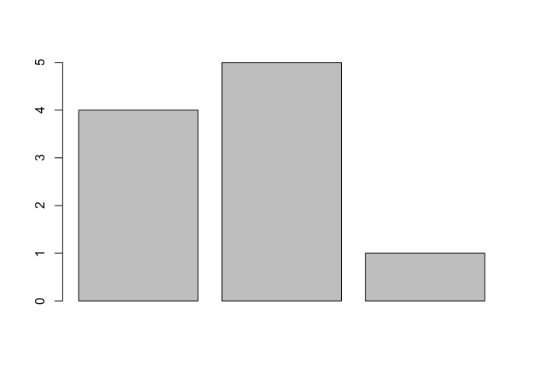
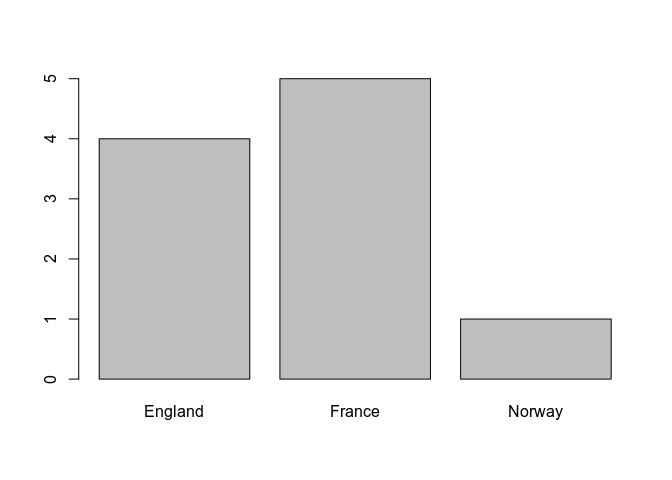
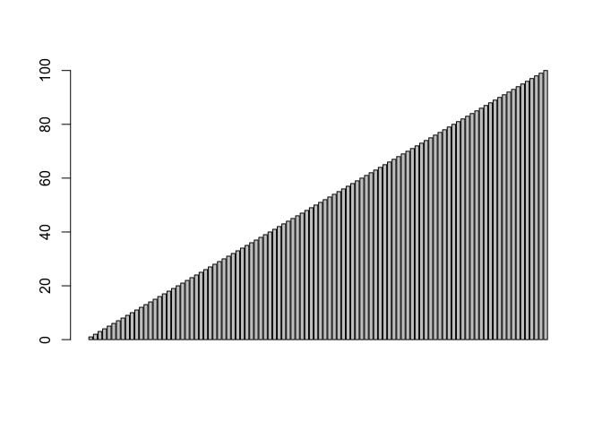

<!-- -->

-----

Namanya mungkin terdengar seperti sesuatu yang rumit, tetapi sebuah
vektor hanyalah sebuah sekumpulan nilai. R bergantung pada vektor untuk
banyak operasinya. Ini termasuk ploting.

## 2.1 Vector

Nilai vektor bisa berupa angka, string, nilai logis atau lainnya,
asalkan mereka mempunyai tipe yang sama. Coba buat vektor angka, seperti
ini:

``` r
c(4,7,9)
```

    ## [1] 4 7 9

Fungsi **c** (c adalah kependekan dari Combine) membuat sebuah vektor
baru dengan menggabungkan sekumpulan nilai. Sekarang coba buat vektor
yang berisi karakter:

``` r
c('a','b','v')
```

    ## [1] "a" "b" "v"

Vektor tidak dapat menyimpan nilai dengan tipe yang berbeda, coba buat
vector dengan tipe yang berbeda-beda:

``` r
c(1,TRUE,"three")
```

    ## [1] "1"     "TRUE"  "three"

-----

> \#\#\#Jump \#3\#\#\#

  - Create a vector named ***boolean\_vector*** that contains the three
    elements: TRUE, FALSE and TRUE (in that order)

<!-- end list -->

``` r
boolean_vector <- c(TRUE, FALSE, TRUE)
boolean_vector
```

    ## [1]  TRUE FALSE  TRUE

***For poker\_vector:***  
\- On Monday you won $140  
\- Tuesday you lost $50  
\- Wednesday you won $20  
\- Thursday you lost $120  
\- Friday you won $240  
***For roulette\_vector:***  
\- On Monday you lost $24  
\- Tuesday you lost $50  
\- Wednesday you won $100  
\- Thursday you lost $350  
\- Friday you won $10

Transform above list into vector and have R simply print the vector.

``` r
poker_vector <- c(140, -50, 20, -120, 240)
poker_vector
```

    ## [1]  140  -50   20 -120  240

``` r
sum(poker_vector)
```

    ## [1] 230

``` r
mean(poker_vector)
```

    ## [1] 46

``` r
roulette_vector <- c(-24, -50, 100, -350, 10)
roulette_vector
```

    ## [1]  -24  -50  100 -350   10

``` r
sum(roulette_vector)
```

    ## [1] -314

``` r
mean(roulette_vector)
```

    ## [1] -62.8

-----

Semua nilai dikonversi ke satu tipe yaitu karakter, sehingga vektor akan
dapat menampung semuanya.

## 2.2 Sequence Vector

Jika teman-teman memerlukan vector dengan urutan angka, teman-teman
dapat membuatnya dengan notasi **start:end**. Mari buat vector dengan
nilai dari 5 hingga 9:

``` r
5:9
```

    ## [1] 5 6 7 8 9

Cara lain untuk membuat vector yang berisi urutan angka adalah dengan
fungsi **seq**. Coba kita lakukan hal yang sama dengan diatas dengan
**seq**,

``` r
seq(5, 9)
```

    ## [1] 5 6 7 8 9

**seq**, juga memungkinkan teman-teman untuk menggunakan *increaments*
selain 1. Cobalah dengan 0,5:

``` r
seq(5, 9, by =  0.5)
```

    ## [1] 5.0 5.5 6.0 6.5 7.0 7.5 8.0 8.5 9.0

Sekarang coba buat vector dengan bilangan bulat dari 9 ke 5 (secara
menurun)

``` r
9:5
```

    ## [1] 9 8 7 6 5

## 2.3 Vector Access

Kita akan membuat vector dengan beberapa string di dalamnya dan
menyimpannya dalam variable **sentence**.

Teman-teman dapat mengambil nilai individu dalam vektor dengan
memberikan indeks numerik dengan menggunakan tanda kurung siku-siku.
Cobalah mendapatkan nilai pada indeks ketiga:

``` r
sentence <- c("walk","the","plank")
sentence
```

    ## [1] "walk"  "the"   "plank"

``` r
sentence[[3]]
```

    ## [1] "plank"

Pada banyak bahasa pemrograman indeks array dimulai dengan 0, tapi di
bahasa pemrograman R, indeks array dimulai dari 1. Untuk mendapatkan
nilai pertama, dapat menggunakan cara:

``` r
sentence[[1]]
```

    ## [1] "walk"

``` r
sentence
```

    ## [1] "walk"  "the"   "plank"

Teman-teman dapat menetapkan nilai baru dalam vektor yang ada. Cobalah
ubah nilai indeks ketiga menjadi “dog”:

``` r
sentence[[3]] <- "dog"
sentence
```

    ## [1] "walk" "the"  "dog"

Kita juga bisa menambahkan nilai baru di akhir vector. Mari menambahkan
kata keempat:

``` r
sentence[[4]] <- "to"
sentence
```

    ## [1] "walk" "the"  "dog"  "to"

Teman-teman dapat menggunakan kurung siku untuk mengakses banyak nilai
dalam sebuah vector. Coba dapatkan nilai indeks ke-1 dan ke-3:

``` r
sentence[c(1, 3)]
```

    ## [1] "walk" "dog"

``` r
sentence
```

    ## [1] "walk" "the"  "dog"  "to"

Ini berarti teman-teman dapat mengakses nilai indeks ke-2 sampai ke-4:

``` r
sentence[c(2:4)]
```

    ## [1] "the" "dog" "to"

teman-teman juga dapat menggunakan *range* nilai:

``` r
sentence[5:7] <- c("the","poop","deck")
sentence
```

    ## [1] "walk" "the"  "dog"  "to"   "the"  "poop" "deck"

Sekarang coba akses nilai indeks ke-6

``` r
sentence[[6]]
```

    ## [1] "poop"

``` r
sentence
```

    ## [1] "walk" "the"  "dog"  "to"   "the"  "poop" "deck"

## 2.4 Vector Names

Untuk *challenge* kali ini, buatlah vektor yang berisi 3 nilai dengan
tipe karakter/string dan simpan dalam variabel **ranks**. Teman-teman
dapat menetapkan nama ke elemen vektor dengan melewatkan vektor kedua
dengan fungsi **names**, seperti:

``` r
ranks <- 1:3
names(ranks) <- c("first", "second", "third")
ranks
```

    ##  first second  third 
    ##      1      2      3

Menetapkan nama untuk sebuah vektor dapat berguna sebagai label untuk
data. Di bawah ini, teman-teman dapat melihat seperti apa vektor kita
sekarang. Teman-teman juga dapat menggunakan nama untuk mengakses
nilai-nilai vektor. Cobalah akses nilai indeks ke-1 dengan menggunakan
**“first”**:

``` r
ranks[["first"]]
```

    ## [1] 1

Sekarang isi nilai saat ini untuk indeks “third” dengan nilai yang
berbeda dengan sebelumnya:

``` r
ranks[["third"]] <- 4
ranks
```

    ##  first second  third 
    ##      1      2      4

-----

> \#\#\#Jump \#4\#\#\#

***For poker\_vector:***  
\- On Monday you won $140  
\- Tuesday you lost $50  
\- Wednesday you won $20  
\- Thursday you lost $120  
\- Friday you won $240  
***For roulette\_vector:***  
\- On Monday you lost $24  
\- Tuesday you lost $50  
\- Wednesday you won $100  
\- Thursday you lost $350  
\- Friday you won $10

Transform above list into vector and add names on it and have R simply
print the vector.

``` r
days <- c("Monday", "Tuesday", "Wednesday", "Thursday", "Friday")

poker_vector <- c(140, -50, 20, -120, 240)
names(poker_vector) <- days
poker_vector
```

    ##    Monday   Tuesday Wednesday  Thursday    Friday 
    ##       140       -50        20      -120       240

``` r
roulette_vector <- c(-24, -50, 100, -350, 10)
names(roulette_vector) <- days
roulette_vector
```

    ##    Monday   Tuesday Wednesday  Thursday    Friday 
    ##       -24       -50       100      -350        10

-----

## 2.5 Plotting One Vector

Fungsi **barplot** menggambar chart menggunakan nilai yang berasal dari
vector. Kita akan membuat sebuah vector dan menyimpannya di variabel
**vesselSunk**.

Sekarang coba lewatkan vector yang sudah kita buat kedalam fungsi
barplot:

``` r
vesselsSunk <- c(4,5,1)

barplot(vesselsSunk)
```

<!-- -->

Jika teman-teman menetapkan nama pada vector diatas. R akan menggunakan
nama-nama itu sebagai label di barplot.

``` r
names(vesselsSunk) <- c("England", "France", "Norway")
```

Sekarang, jika teman-teman memanggil barplot dengan melewatkan vector
vesselSunk lagi, teman-teman akan melihat label pada sumbu x:

``` r
barplot(vesselsSunk)
```

<!-- -->

Sekarang, coba panggil barplot dengan vektor bilangan bulat mulai dari 1
hingga 100:

``` r
barplot(1:100)
```

<!-- -->

## 2.6 Vector Math

Sebagian besar operasi aritmatika bekerja baik pada nilai satuan atau
pada vector. Kita akan membuat vector sampel lain untuk teman-teman
gunakan dan menyimpannya dalam variabel **a**.

Jika teman-teman menambahkan nilai skalar (nilai satuan) pada sebuah
vector, maka nilai skalar akan ditambahkan ke setiap nilai dalam vektor,
mengembalikan vektor baru dengan nilai hasil penambahan. Coba tambahkan
nilai 1 ke setiap elemen di vector:

``` r
a <- c(1, 2, 3)

a + 1
```

    ## [1] 2 3 4

Hal yang sama berlaku untuk pembagian, perkalian atau setiap operasi
dasar aritmatika. Sekarang coba bagi vector kita dengan 2:

``` r
a / 2
```

    ## [1] 0.5 1.0 1.5

Sekarang coba kali vector kita dengan 2:

``` r
a * 2
```

    ## [1] 2 4 6

Jika teman-teman menambahkan dua vektor, R akan menambahkan nilai dari
kedua vector tersebut. Kita akan buat vector kedua dan menyimpannya di
variabel **b**.

Sekarang coba tambahkan vector a dan b:

``` r
b <- c(4, 5, 6)

a + b
```

    ## [1] 5 7 9

Sekarang coba kurangi vector a oleh vector b:

``` r
a - b
```

    ## [1] -3 -3 -3

Teman-teman juga dapat mengambil dua vektor dan membandingkan nilainya:

``` r
a == c(1, 99, 3)
```

    ## [1]  TRUE FALSE  TRUE

Perhatikan bahwa R tidak menguji apakah keseluruhan vector sama, tapi
melakukan pengecekan satu-satu terhadap nilai vector satu sama lain.

``` r
a < b
```

    ## [1] TRUE TRUE TRUE

Fungsi juga dapat bekerja dengan nilai skalar ataupun vector, coba
dapatkan nilai sinus untuk tiap elemen vector a:

``` r
sin(a)
```

    ## [1] 0.8414710 0.9092974 0.1411200

Sekarang coba untuk mendapatkan akar pangkat dua dari vector a:

``` r
sqrt(a)
```

    ## [1] 1.000000 1.414214 1.732051

## 2.7 NA Values

Kadang-kadang, ketika bekerja dengan data sampel nilai yang diberikan
tidak tersedia. Tetapi bukan ide yang baik, untuk membuang nilai-nilai
tersebut. R memiliki nilai yang mampu menunjukkan sampel yang tidak
tersedia: **NA**. Banyak fungsi bekerja dengan vektor memperlakukan
nilai ini secara khusus.

Kita akan membuat vektor dengan nilai sample yang hilang dan
menyimpannya dalam variabel **a**

Cobalah untuk mendapatkan jumlah dari vector a dan lihat hasilnya:

``` r
a <- c(1, 3, NA, 7, 9)

sum(a)
```

    ## [1] NA

Coba panggil sum lagi dengan **na.rm** diisi nilai TRUE:

``` r
sum(a, na.rm = TRUE)
```

    ## [1] 20
