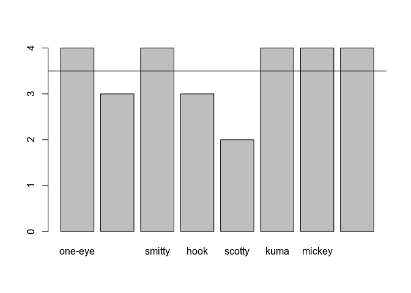
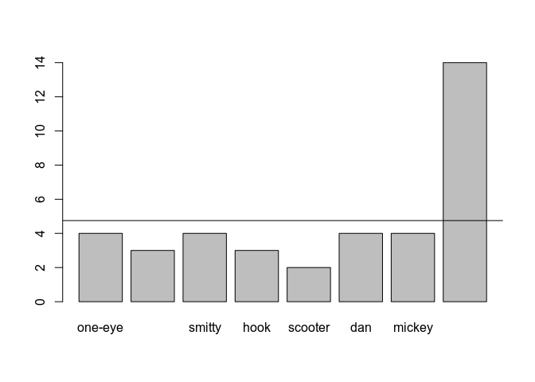
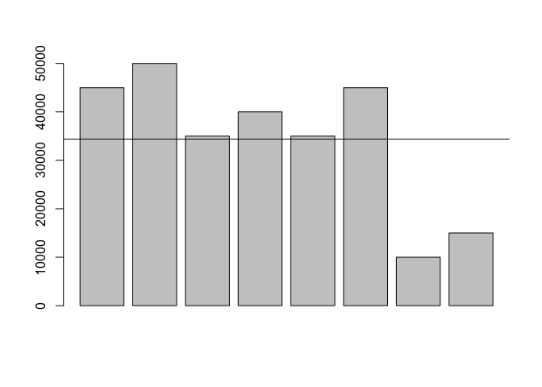

<!-- -->

-----

Salah satu tugas penting dari seorang data scientist adalah menjelaskan
data yang berupa angka-angka, untuk memberi makna dari angka-angka
tersebut. Pada bagian ini kita akan menggunakan R untuk sedikit membantu
kita dalam memberi makna pada angka-angka tersebut.

Kita akan coba menjalankan skenario sebagai kapten bajak laut dan
menggunakan R untuk satu atau dua hal. :D

## 4.1 Mean

Kesehatan para awak kapal sangatlah penting sebagai bagian dari kesiapan
bajak laut. Kita akan membuat vector yang berisi tingkat kesehatan para
awak kapal beserta nama mereka:

``` r
healths <- c(4, 3, 4, 3, 2, 4, 4, 4)

names(healths) <- c("one-eye", "peg-leg", "smitty", "hook", "scotty", "kuma", "mickey", "blackbeard")
```

Cara cepat untuk menilai kesiapan awak kapal adalah dengan membuat
rata-rata dari keseluruhan tingkat kesehatan awak kapal. Ya\!
Teman-teman di statistik menyebut cara diatas dengan **“mean”**—mean
bukan satu-satunya cara menghitung rata-rata. Kita bisa menggunakan
fungsi **mean** dan melewatkan vector diatas sebagai parameternya:

``` r
mean(healths)
```

    ## [1] 3.5

Rata-rata kesehatan awak kapal lebih mendekati angka 4 dan itu
menyenangkan. Kita akan coba menggambarkannya menggunakan barplot:

``` r
barplot(healths)
```

<!-- -->

Pada plot diatas kita dapat menambahkan garis yang menggambarkan mean
sehingga kita dapat dengan mudah membandingkan tiap nilai kesehatan para
awak. Fungsi **abline** mempunyai parameter h (horizontal) dengan nilai
diisi nilai mean untuk menggambar garis horizontal atau parameter v
(vertikal) untuk kebutuhan lainnya. Setelah ditambahkan abline maka
memperbaharui tampilan barplot sebelumnya:

``` r
barplot(healths)

abline(h = mean(healths))
```

<!-- -->

## 4.2 Median

Kita akan mengubah vector health dikarenakan ada awak kapal yang mundur
dan digantikan oleh awak kapal baru.

Mari kita lihat bagaimana mean dengan awak kapal baru ini muncul di
grafik yang sama:

``` r
healths <- c(4,3,4,3,2,4,4,14)

names(healths) <- c("one-eye","peg-leg","smitty","hook","scooter","dan","mickey","davy jones")

mean(healths)
```

    ## [1] 4.75

Ini mungkin benar-benar akurat untuk mengatakan bahwa kru kita memiliki
rata-rata 4,75, tetapi ini mungkin juga menyesatkan.

``` r
barplot(healths)

abline(h = mean(healths))
```

<!-- -->

Untuk situasi diatas, mungkin akan lebih membantu jika kita menggunakan
**median** daripada mean. Dengan median, maka kita akan dibantu untuk
mendapatkan nilai tengah setelah diurutkan—untuk nilai yang akan dicari
mediannya berjumlah genap maka 2 nilai tengah kemudian dibagi 2.

Sekarang kita coba panggil fungsi median dengan vector healths sebagai
parameternya:

``` r
median(healths)
```

    ## [1] 4

Sekarang lebih masuk diakal. Berikutnya kita akan coba gambarkan kedalam
barplot dan menambahkan garis horizontal sebagai mediannya:

``` r
barplot(healths)

abline(h = median(healths))
```

<!-- -->

## 4.3 Standard Deviation

Beberapa penjarahan dari serangan kita baru-baru ini bernilai kurang
dari apa yang biasa kita dapatkan. Berikut adalah vektor dengan
nilai-nilai dari penjarahan terbaru kita:

``` r
pounds <- c(45000, 50000, 35000, 40000, 35000, 45000, 10000, 15000)

barplot(pounds)
```

<!-- -->

``` r
meanValue <- mean(pounds)
```

Mari kita lihat plot yang menunjukkan nilai rata-rata:

``` r
barplot(pounds)

abline(h = meanValue)
```

<!-- -->

Hasil ini tampak jauh di bawah normal. Para awak kapal berpikir ini
kesalahan Smitty dan ingin agar dia jadi santapan para hiu (\>:).
Sebelum Smitty loncat dan menjadi santapan hiu, Smitty bertanya: \>
“Seberapa ‘normal’ nilai dari jarahan yang ‘normal’ itu teman?”.

Statistik menggunakan konsep **“standar deviasi”** dari mean untuk
mendeskripsikan range nilai untuk kumpulan data. Untuk satu kelompok
angka, ini menunjukkan berapa banyak variasi dari nilai rata-rata. Untuk
menghitung standar deviasi, kita menghitung mean dari nilai-nilai
kemudian kurangi mean dari masing-masing angka, kemudian kuadratkan
hasilnya, setelah itu dibuatkan rata-ratanya dan terakhir di akar
kuadratkan.

Terdengar rumit dan membingungkan? Untungnya kita menggunakan R dan kita
bisa menggunakan fungsi **sd** kemudian melewatkan sebuah vector sebagai
parameternya. Kita coba panggil fungsi sd dan vector pounds sebagai
parameternya:

``` r
deviation <- sd(pounds)

deviation
```

    ## [1] 14500.62

Tambahkan garis horizontal pada barplot kita untuk menunjukkan standar
deviasi di atas rata-rata (diatas kisaran normal)

``` r
barplot(pounds)

abline(h = meanValue)
abline(h = meanValue + deviation)
```

<!-- -->

Yeaay kita mendapatkan jarahan senilai 50.000\!

Sekarang coba tambahkan garis untuk standar deviasi dibawah mean.
(dibawah kisaran normal):

``` r
barplot(pounds)

abline(h = meanValue)
abline(h = meanValue + deviation)
abline(h = meanValue - deviation)
```

<!-- -->

> **Kita hampir digantung oleh orang-orang Spanyol hanya untuk ini?\!
> Smitty\!\! Loncat sekarang juga\!**
