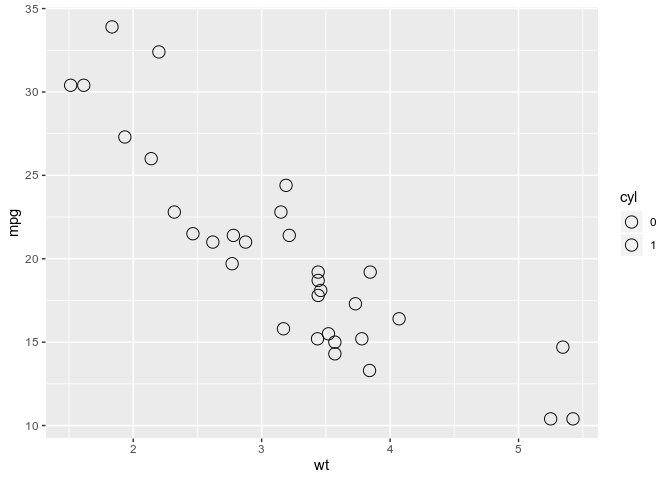
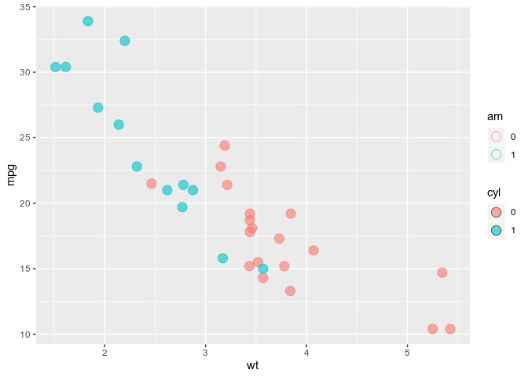
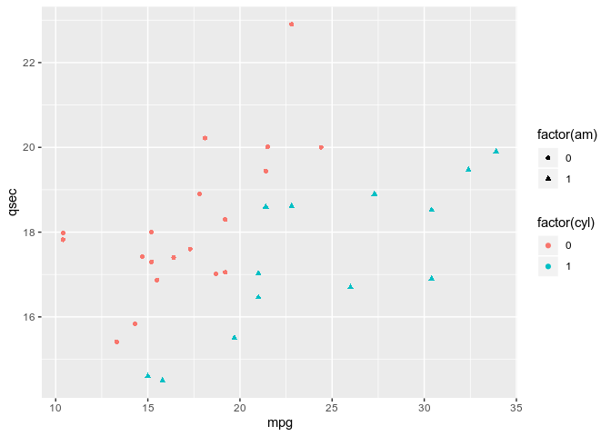
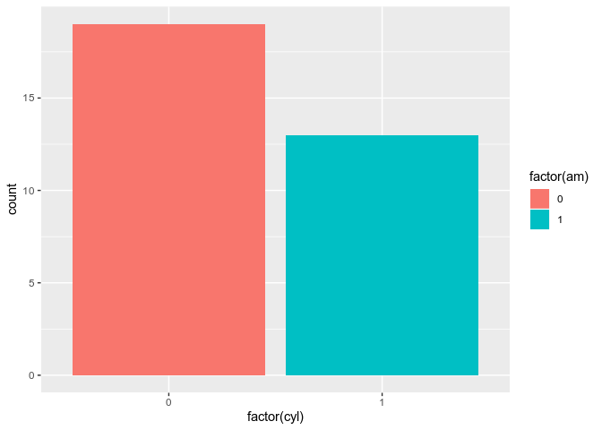
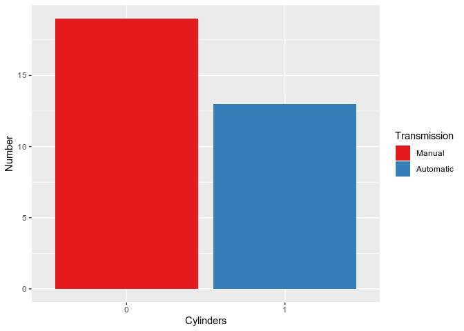

<!-- -->

-----

ggplot2 adalah sistem untuk membuat grafik secara deklaratif,
berdasarkan **The Grammar of Graphics**. Kita cukup memberikan data,
memberi tahu ggplot2 cara memetakan variabel ke *aesthetics*, jenis
grafis apa yang digunakan, dan ggplot2 akan mengurus detailnya.

## 7.1 Install and load library

Cara termudah adalah dengan menginstall package tidyverse:

``` r
install.packages("tidyverse")
```

Atau cukup install package ggplot2:

``` r
install.packages("ggplot2")
```

Load ggplot2

``` r
library(ggplot2)
```

## 7.2 Warming up and test drive

Eksplorasi data frame mtcars dengan str()

``` r
str(mtcars)
```

    ## 'data.frame':    32 obs. of  11 variables:
    ##  $ mpg : num  21 21 22.8 21.4 18.7 18.1 14.3 24.4 22.8 19.2 ...
    ##  $ cyl : num  6 6 4 6 8 6 8 4 4 6 ...
    ##  $ disp: num  160 160 108 258 360 ...
    ##  $ hp  : num  110 110 93 110 175 105 245 62 95 123 ...
    ##  $ drat: num  3.9 3.9 3.85 3.08 3.15 2.76 3.21 3.69 3.92 3.92 ...
    ##  $ wt  : num  2.62 2.88 2.32 3.21 3.44 ...
    ##  $ qsec: num  16.5 17 18.6 19.4 17 ...
    ##  $ vs  : num  0 0 1 1 0 1 0 1 1 1 ...
    ##  $ am  : num  1 1 1 0 0 0 0 0 0 0 ...
    ##  $ gear: num  4 4 4 3 3 3 3 4 4 4 ...
    ##  $ carb: num  4 4 1 1 2 1 4 2 2 4 ...

Mapping silinder (cyl) ke sumbu X dan kebutuhan bahan bakar per mil
(mpg) ke sumbu Y

``` r
ggplot(mtcars, aes(x = cyl, y = mpg)) +
  geom_point()
```

<!-- -->

Mengubah cyl menjadi sebuah factor

``` r
ggplot(mtcars, aes(x = factor(cyl), y = mpg)) +
  geom_point()
```

<!-- -->

-----

> \#\#\#Exercise\#\#\#

``` r
# Scatter plot dasar
ggplot(mtcars, aes(x = wt, y = mpg)) +
  geom_point()
```

<!-- -->

``` r
# Ganti ___ dengan salah satu parameter aesthetics; color ATAU size
ggplot(mtcars, aes(x = wt, y = mpg, color = disp)) +
  geom_point()
```

<!-- -->

``` r
# Ganti ___ dengan salah satu parameter aesthetics; color ATAU size
ggplot(mtcars, aes(x = wt, y = mpg, size = disp)) +
  geom_point()
```

<!-- -->

-----

## 7.3 Smoothing diamonds

Eksplorasi data frame diamonds dengan
    str()

``` r
str(diamonds)
```

    ## Classes 'tbl_df', 'tbl' and 'data.frame':    53940 obs. of  10 variables:
    ##  $ carat  : num  0.23 0.21 0.23 0.29 0.31 0.24 0.24 0.26 0.22 0.23 ...
    ##  $ cut    : Ord.factor w/ 5 levels "Fair"<"Good"<..: 5 4 2 4 2 3 3 3 1 3 ...
    ##  $ color  : Ord.factor w/ 7 levels "D"<"E"<"F"<"G"<..: 2 2 2 6 7 7 6 5 2 5 ...
    ##  $ clarity: Ord.factor w/ 8 levels "I1"<"SI2"<"SI1"<..: 2 3 5 4 2 6 7 3 4 5 ...
    ##  $ depth  : num  61.5 59.8 56.9 62.4 63.3 62.8 62.3 61.9 65.1 59.4 ...
    ##  $ table  : num  55 61 65 58 58 57 57 55 61 61 ...
    ##  $ price  : int  326 326 327 334 335 336 336 337 337 338 ...
    ##  $ x      : num  3.95 3.89 4.05 4.2 4.34 3.94 3.95 4.07 3.87 4 ...
    ##  $ y      : num  3.98 3.84 4.07 4.23 4.35 3.96 3.98 4.11 3.78 4.05 ...
    ##  $ z      : num  2.43 2.31 2.31 2.63 2.75 2.48 2.47 2.53 2.49 2.39 ...

Tambahkan geom\_point() dan geom\_smooth() dengan “+”

``` r
ggplot(diamonds, aes(x = carat, y = price)) +
  geom_point() +
  geom_smooth()
```

    ## `geom_smooth()` using method = 'gam' and formula 'y ~ s(x, bs = "cs")'

    ## Warning in seq.default(0, 1, length = nk): partial argument match of
    ## 'length' to 'length.out'

    ## Warning in model.matrix.default(Terms[[i]], mf, contrasts =
    ## object$contrasts): partial argument match of 'contrasts' to 'contrasts.arg'

<!-- -->

## 7.4 Understanding grammar in ggplot

Di sini kita akan mengeksplorasi beberapa elemen ggplot yang berbeda.
Kita akan menemukan bagaimana elemen-elemen dapat digabungkan dalam
berbagai cara untuk mengembangkan plot unik.

Berikutnya kita akan mulai dengan membuat objek ggplot dari dataset
diamonds. Selanjutnya, Anda akan menambahkan *layer* ke objek ini untuk
membangun plot yang indah & informatif.

Ciptakan objek yang berisi data dan aes layer : dia\_plot

``` r
dia_plot <- ggplot(diamonds, aes(x = carat, y = price))
```

Tambahkan geom\_point()

``` r
dia_plot + geom_point()
```

<!-- -->

Tambahkan aes() didalam geom\_point

``` r
dia_plot + geom_point(aes(color = clarity))
```

<!-- -->

## 7.5 Linear model X ggplot

Gunakan lm() to menghitung model linear kemudian simpan carModel

``` r
carModel <- lm(mpg ~ wt, data = mtcars)
```

``` r
# Plot dasar
mtcars$cyl <- as.factor(mtcars$cyl)
plot(mtcars$wt, mtcars$mpg, col = mtcars$cyl)
# Gunakan abline() dengan carModel sebagai parameter kesatu dan parameter lty diisi 2
abline(carModel, lty = 2)
```

<!-- -->

``` r
# Plot tiap subset dengan lapply()
plot(mtcars$wt, mtcars$mpg, col = mtcars$cyl)
lapply(mtcars$cyl, function(x) {
  abline(lm(mpg ~ wt, mtcars, subset = (cyl == x)), col = x)
  })
```

    ## [[1]]
    ## NULL
    ## 
    ## [[2]]
    ## NULL
    ## 
    ## [[3]]
    ## NULL
    ## 
    ## [[4]]
    ## NULL
    ## 
    ## [[5]]
    ## NULL
    ## 
    ## [[6]]
    ## NULL
    ## 
    ## [[7]]
    ## NULL
    ## 
    ## [[8]]
    ## NULL
    ## 
    ## [[9]]
    ## NULL
    ## 
    ## [[10]]
    ## NULL
    ## 
    ## [[11]]
    ## NULL
    ## 
    ## [[12]]
    ## NULL
    ## 
    ## [[13]]
    ## NULL
    ## 
    ## [[14]]
    ## NULL
    ## 
    ## [[15]]
    ## NULL
    ## 
    ## [[16]]
    ## NULL
    ## 
    ## [[17]]
    ## NULL
    ## 
    ## [[18]]
    ## NULL
    ## 
    ## [[19]]
    ## NULL
    ## 
    ## [[20]]
    ## NULL
    ## 
    ## [[21]]
    ## NULL
    ## 
    ## [[22]]
    ## NULL
    ## 
    ## [[23]]
    ## NULL
    ## 
    ## [[24]]
    ## NULL
    ## 
    ## [[25]]
    ## NULL
    ## 
    ## [[26]]
    ## NULL
    ## 
    ## [[27]]
    ## NULL
    ## 
    ## [[28]]
    ## NULL
    ## 
    ## [[29]]
    ## NULL
    ## 
    ## [[30]]
    ## NULL
    ## 
    ## [[31]]
    ## NULL
    ## 
    ## [[32]]
    ## NULL

``` r
# Tampilkan legend
legend(x = 5, y = 33, legend = levels(mtcars$cyl),
       col = 1:3, pch = 1, bty = "n")
```

<!-- -->

``` r
ggplot(mtcars, aes(x = wt, y = mpg, colour = cyl)) +
  geom_point() +
  geom_smooth(method = "lm", se = FALSE, fullrange = TRUE) +
  scale_colour_manual(values = c("black", "red", "green")) +
  ggthemes::theme_base()
```

<!-- -->

## 7.6 Keep in touch with **aesthetics**

Pastikan am dan cyl berupa factor sedangkan wt berupa numeric

``` r
class(mtcars$am) # ubah jadi factor
```

    ## [1] "numeric"

``` r
class(mtcars$cyl)
```

    ## [1] "factor"

``` r
class(mtcars$wt)
```

    ## [1] "numeric"

``` r
# Plot dasar
ggplot(mtcars, aes(x = wt, y = mpg, col = cyl)) +
  geom_point(shape = 1, size = 4)
```

<!-- -->

1 - Pasang cyl ke parameter fill

``` r
ggplot(mtcars, aes(x = wt, y = mpg, fill = cyl)) +
  geom_point(shape = 1, size = 4)
```

<!-- -->

2 - Ubah shape dan alpha dari titik-titik pada plot diatas

``` r
ggplot(mtcars, aes(x = wt, y = mpg, fill = cyl)) +
  geom_point(shape = 21, size = 4, alpha = 0.6)
```

<!-- -->

3 - Pasang am ke parameter col

``` r
ggplot(mtcars, aes(x = wt, y = mpg, col = am, fill = cyl)) +
  geom_point(shape = 21, size = 4, alpha = 0.6)
```

<!-- -->

## 7.7 Keep in touch with **attributes**

Gambar scatter plot dengan alpha 0.5

``` r
ggplot(mtcars, aes(x = wt, y = mpg, fill = cyl)) +
  geom_point(alpha = 0.5)
```

<!-- -->

Gambar scatter plot dengan shape 24 dan color yellow

``` r
ggplot(mtcars, aes(x = wt, y = mpg, fill = cyl)) +
  geom_point(shape = 24, col = "yellow")
```

<!-- -->

## 7.8 Goin’ all out\!

Pasang mpg ke sumbu x, pasang qsec ke sumbu y dan factor(cyl) pada col

``` r
ggplot(mtcars, aes(x= mpg, y=qsec, col=factor(cyl))) +
  geom_point()
```

<!-- -->

Pasang factor(am) ke parameter shape

``` r
ggplot(mtcars, aes(x= mpg, y=qsec, col=factor(cyl), shape=factor(am))) +
  geom_point()
```

<!-- -->

Pasang (hp/wt) ke parameter
size

``` r
ggplot(mtcars, aes(x= mpg, y=qsec, col=factor(cyl), shape=factor(am), size=(hp/wt))) +
  geom_point()
```

<!-- -->

## 7.9 Modifying aesthetics (position)

Plot dasar

``` r
cyl.am <- ggplot(mtcars, aes(x = factor(cyl), fill = factor(am)))
```

Tambahkan geom\_bar()

``` r
cyl.am + 
  geom_bar()
```

<!-- -->

Tambahkan parameter position dengan isi **“fill”**

``` r
cyl.am + 
  geom_bar(position = "fill")
```

<!-- -->

Isi position dengan **“dodge”** untuk membuat grouping

``` r
cyl.am +
  geom_bar(position = "dodge")
```

<!-- -->

Gunakan fungsi scale\_\* untuk merapikan sumbu x dan y

``` r
val = c("#E41A1C", "#377EB8")
lab = c("Manual", "Automatic")
cyl.am +
  geom_bar(position = "dodge") +
  scale_x_discrete("Cylinders") + 
  scale_y_continuous("Number") +
  scale_fill_manual("Transmission", 
                    values = val,
                    labels = lab)
```

<!-- -->
